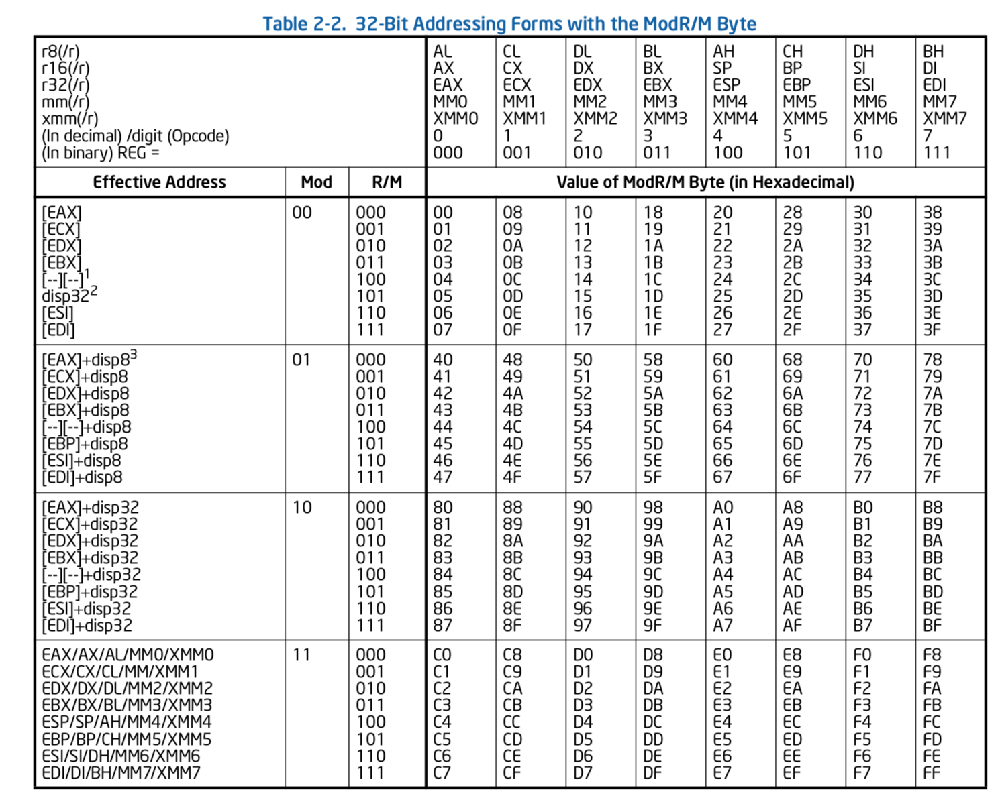

# Debugging shikata ga nai encoder
### Execve() shellcode running /bin/sh:
```
"\x31\xc0\x50\x68\x2f\x2f\x73\x68\x68\x2f\x62\x69\x6e\x89\xe3\x50\x89\xe2\x53\x89\xe1\xb0\x0b\xcd\x80"
25 bytes /bin/sh shellcode
```

### Msfvenom encodes shellcode with shikata ga nai (one iteration):
```
echo -ne "\x31\xc0\x50\x68\x2f\x2f\x73\x68\x68\x2f\x62\x69\x6e\x89\xe3\x50\x89\xe2\x53\x89\xe1\xb0\x0b\xcd\x80" | msfvenom -a x86 --platform linux -e x86/shikata_ga_nai -f c -p - 

"\xda\xc2\xd9\x74\x24\xf4\x58\x29\xc9\xbe\x45\x59\xe9\x68\xb1"
"\x07\x31\x70\x18\x83\xe8\xfc\x03\x70\x51\xbb\x1c\x59\x99\x6b"
"\xb7\xb5\x36\xff\x2f\xa2\x67\x9d\xc6\x5c\xfe\x82\x49\x28\xe2"
"\x16\xe3\xcb\x52\x93\x3e\x8b"
```
### Put this into c wrapper, compile with gcc 

```
gcc -fno-stack-protector -z execstack shellcode.c -o shellcode
gdb ./shellcode

(gdb) break *&code
Breakpoint 1 at 0x804a040
(gdb) r
Starting program: 
Shellcode Length:  52

Breakpoint 1, 0x0804a040 in code ()
(gdb) set disassembly-flavor intel
(gdb) disassemble 
Dump of assembler code for function code:
=> 0x0804a040 <+0>:	fcmovb st,st(2)
   0x0804a042 <+2>:	fnstenv [esp-0xc]
   0x0804a046 <+6>:	pop    eax
   0x0804a047 <+7>:	sub    ecx,ecx
   0x0804a049 <+9>:	mov    esi,0x68e95945
   0x0804a04e <+14>:	mov    cl,0x7
   0x0804a050 <+16>:	xor    DWORD PTR [eax+0x18],esi
   0x0804a053 <+19>:	sub    eax,0xfffffffc
   0x0804a056 <+22>:	add    esi,DWORD PTR [eax+0x51]
   0x0804a059 <+25>:	mov    ebx,0x6b99591c
   0x0804a05e <+30>:	mov    bh,0xb5
   0x0804a060 <+32>:	jmp    FWORD PTR ss:[edi]
   0x0804a063 <+35>:	mov    ds:0x5cc69d67,al
   0x0804a068 <+40>:	inc    BYTE PTR [edx+0x16e22849]
   0x0804a06e <+46>:	jecxz  0x804a03b
   0x0804a070 <+48>:	push   edx
   0x0804a071 <+49>:	xchg   ebx,eax
   0x0804a072 <+50>:	mov    eax,DWORD PTR ds:[eax]
End of assembler dump.

```
### Debugging the shikata ga nai encoder

The first two instructions fcmovb, fnstenv, store the FPU environment onto the stack and pop onto the eax register
Reference: 
Intel® 64 and IA-32 Architectures Software Developer's Manual Volume 1: Basic Architecture Chapter 8.1.10

And next three just predefine the key for xor for first loop, and clear out the ecx and mov 7 to ecx counter for looping 
as the original shellcode only 25 bytes, and shikta ga nai encode 4 bytes per loop.
```
sub    ecx,ecx
mov    esi,0x68e95945
mov    cl,0x7

```

### Then let's move to decoding loop part

Define a hook stop to exmine the process of decoding
---
```
(gdb) define hook-stop
Type commands for definition of "hook-stop".
End with a line saying just "end".
>disassemble 
>x/52xb &code
>end
```
x/52xb &code command shows 52 bytes from the ever begining of the shellcode to the last
print /x $eax will print the hexa value of eax register.

As the instruction, *xor    DWORD PTR [eax+0x18],esi*, indicates that XOR starts from 0x0804a040 + 0x18,
which is at 0x0804a058.

0x0804a056 <+22>:	add    esi,DWORD PTR [eax+0x51]
Decoding happens at the last byte of add instruction, which is the displacement part of the instruction. 

Exmine the opcode at **0x0804a056** 
*Before decoding:* 03 70 51    0x0804a056 <+22>:	add    esi,DWORD PTR [eax+0x51]
*After decoding: *  03 70 14    0x0804a056 <+22>:	add    esi,DWORD PTR [eax+0x14]

#### The format of Intel instructions:

| INSTRUCTION PREFIX | OPCODE        | ModR/M             | SIB                | DISPLACEMENT   | IMMEDIATE      |
|:------------------:|:-------------:|:------------------:|:------------------:|:--------------:|:--------------:|
| Optional 1 Byte    | 1,2 or 3 Byte | 1 Byte if required | 1 Byte if required | 1, 2 or 4 Byte | 1, 2 or 4 Byte |


|OPCODE|ModR/M|DISPLACEMENT|
|---|---|---|
|03 |70 |51 |

The format of ModR/M Byte:

|Mod |Register/Opcode|R/M|
|---|---|---|
|0-1 bit |2-4 bit |5-7 bit|

For our instance Byte 0x70, the binary representation is:

0111 0000

- 01 is Mod bits
- 110 is Register bits representing Esi register in this case
- 000 is R/M bits representing Eax register and works with later displacement byte to identify an address of a memory





